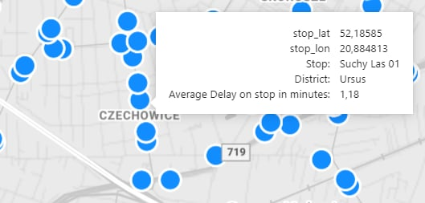
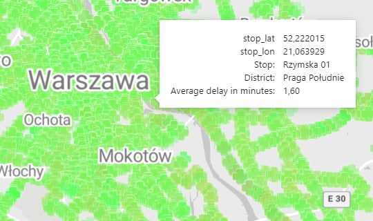
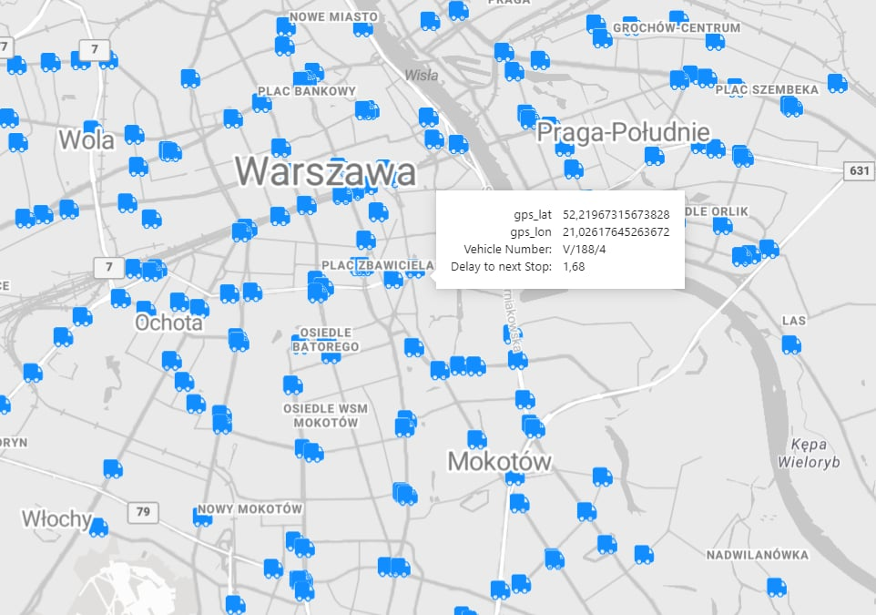
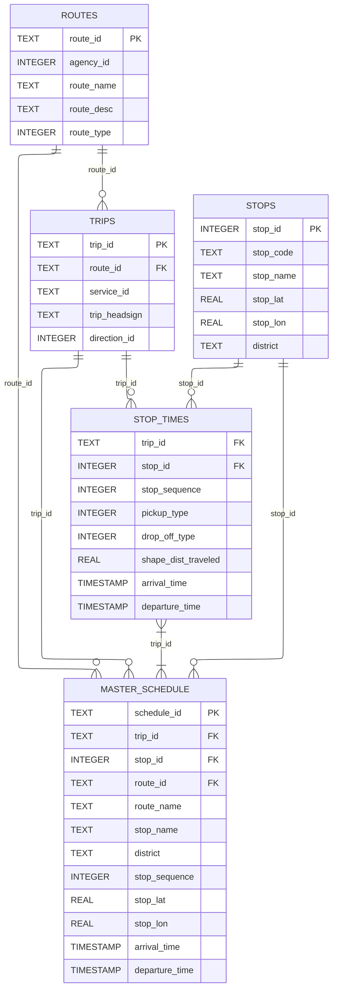
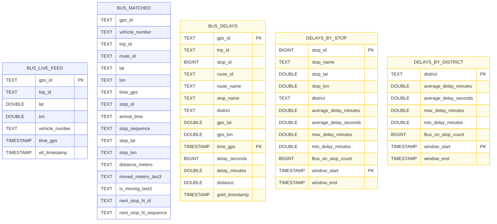
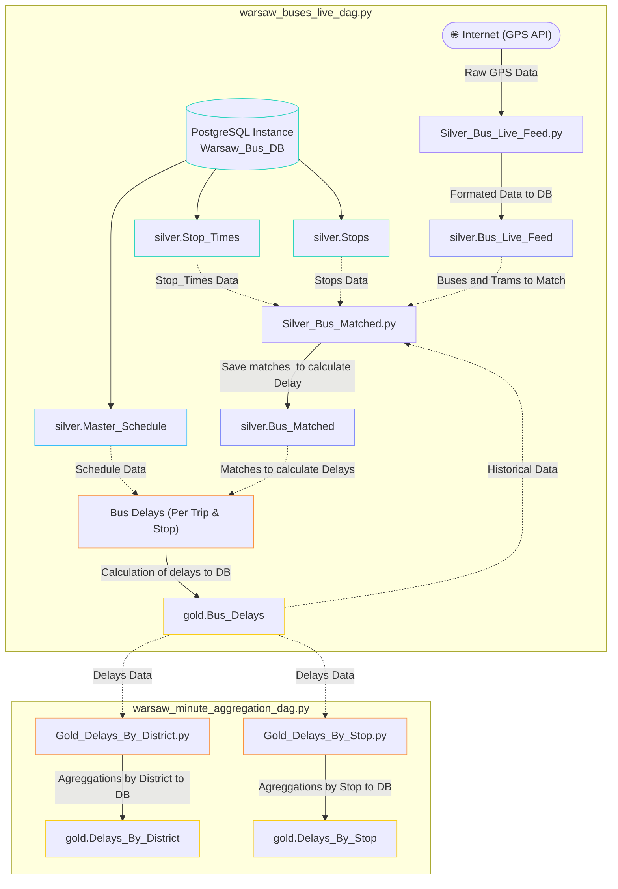

# Transit Delay Analysis - Warsaw Buses and Trams

##  Project Overview
This project focuses on creating a working data pipeline, capable of connecting live GPS data with the ZTM Warsaw schedule, to calculate delays for buses and trams in Warsaw. The delays are displayed and analyzed on real-time dashboards, providing on-map visualizations of delays by stop, as well as a fleet map showing the locations of vehicles and their delay status. 

---

## How to Use This Repository
1. Clone the repository and navigate to the project directory.
```bash
   git clone https://github.com/mbmmle/Ztm-Transit-delays-analysis.git
```
2. Use docker compose in cloned folder to build and run the containers:
```bash
   docker-compose up --build
```
3. Access Airflow UI at `http://localhost:8080` to monitor DAGs and trigger them manually all 3:
`warsaw_master_schedule_dag.py`, `warsaw_buses_live_dag.py`, `warsaw_minute_aggregation_dag.py`.
4. Open `visualizations.pbix` to view real-time visualizations. You may need to login to postgresql server to access the database, in order for visualizations to work.
#### Credentials:
   * Server: `localhost`
   * Database: `Warsaw_Bus_DB`
   * Username: `admin`
   * Password: `admin`
---

**WARNING:** Notebooks in work directory are deprecated, scripts are working app components.

---

##  Tech Stack
* **Docker** - for containerization
* **PostgreSQL** - for DB storage and Power BI DirectQuery streaming
* **Spark / PySpark** - for processing large GTFS data and aggregations
* **pandas** - for matching data and calculating delays
* **Geopandas** - for district mapping
* **SQLAlchemy** - database engine for pandas
* **Airflow** - for scheduling and orchestrating data pipelines
* **Power BI** - for real-time dashboards and visualizations

---

##  Dashboards and Maps

### Individual Stop Delay Map
<p align="center">
  
</p>

### Heatmap Delay Map
<p align="center">
  
</p>

### Fleet Map
<p align="center">
  
</p>

---

##  Data Architecture
The database is built with PostgreSQL using the Medallion architecture, consisting of three layers:
* **Bronze:** Raw data layer, storing unprocessed GTFS files.
* **Silver:** Processed data layer, storing cleaned and structured GTFS data, live feed data, and matched data.
* **Gold:** Data with business logic applied, storing calculated delays and aggregations by stop and district.

<details = "ER Diagram">
<summary><b>Silver_GTFS Data Storage Diagram </b></summary>



</details>

<details = "ER Diagram">
<summary><b>GPS and Delays Data Storage Diagram</b></summary>



</details>

For more insight on database schema, see [database_schema.md](docs/database_schema.md).

---

## Data Pipeline
Orchestrated with Airflow, the data pipeline consists of three main DAGs:
1. `warsaw_master_schedule_dag.py` - responsible for ingesting and processing GTFS data to populate the `silver` schema with schedule and stop information. Interval: everyday at 2:00 AM.
1. `warsaw_buses_live_dag.py` - responsible for ingesting live GPS data, matching it to the schedule, and calculating delays. Interval: every minute.
2. `warsaw_minute_aggregation_dag.py` - responsible for aggregating delays by stop and district on a minute-level basis for dashboard visualizations. Interval: every minute watits for `warsaw_buses_live_dag.py` to finish.

### DAG Dependencies and Flow (LIVE FEED + DELAYS)



---

## Data Sources
* **warszawa-dzielnice.geojson** - for mapping stops to districts
Source: https://github.com/andilabs/warszawa-dzielnice-geojson
* **GTFS data and live GPS data** - for schedule and route information
Source: https://mkuran.pl/gtfs/

---
