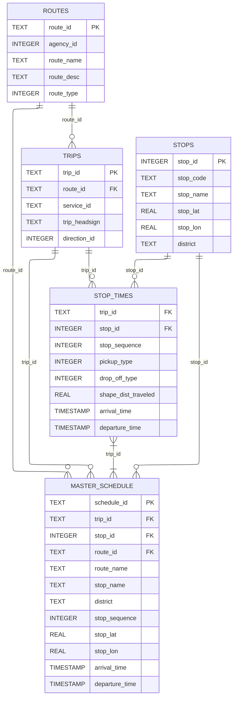
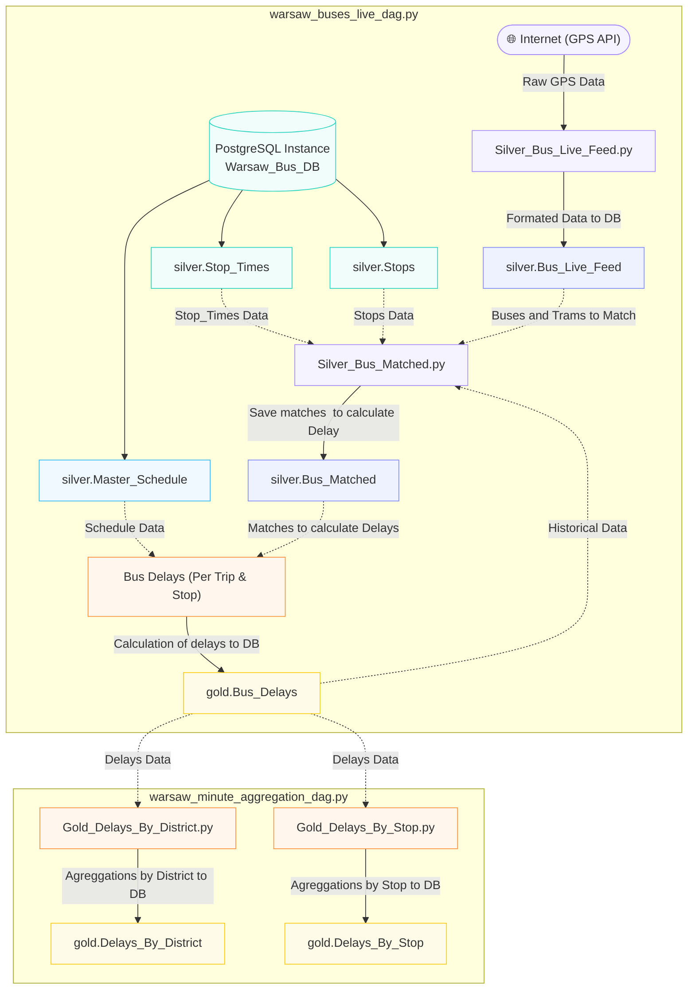

```mermaid
---
config:
  layout: elk
---
erDiagram
	direction TB
	ROUTES {
		TEXT route_id PK ""  
		INTEGER agency_id  ""  
		TEXT route_name  ""  
		TEXT route_desc  ""  
		INTEGER route_type  ""  
	}

	TRIPS {
		TEXT trip_id PK ""  
		TEXT route_id FK ""  
		TEXT service_id  ""  
		TEXT trip_headsign  ""  
		INTEGER direction_id  ""  
	}

	STOPS {
		INTEGER stop_id PK ""  
		TEXT stop_code  ""  
		TEXT stop_name  ""  
		REAL stop_lat  ""  
		REAL stop_lon  ""  
		TEXT district  ""  
	}

	STOP_TIMES {
		TEXT trip_id FK ""  
		INTEGER stop_id FK ""  
		INTEGER stop_sequence  ""  
		INTEGER pickup_type  ""  
		INTEGER drop_off_type  ""  
		REAL shape_dist_traveled  ""  
		TIMESTAMP arrival_time  ""  
		TIMESTAMP departure_time  ""  
	}

	MASTER_SCHEDULE {
		TEXT schedule_id PK ""  
		TEXT trip_id FK ""  
		INTEGER stop_id FK ""  
		TEXT route_id FK ""  
		TEXT route_name  ""  
		TEXT stop_name  ""  
		TEXT district  ""  
		INTEGER stop_sequence  ""  
		REAL stop_lat  ""  
		REAL stop_lon  ""  
		TIMESTAMP arrival_time  ""  
		TIMESTAMP departure_time  ""  
	}

	ROUTES||--o{TRIPS:"route_id"
	ROUTES||--o{MASTER_SCHEDULE:"route_id"
	TRIPS||--o{STOP_TIMES:"trip_id"
	TRIPS||--o{MASTER_SCHEDULE:"trip_id"
	STOPS||--o{STOP_TIMES:"stop_id"
	STOPS||--o{MASTER_SCHEDULE:"stop_id"
	STOP_TIMES}|--|{MASTER_SCHEDULE:"trip_id"
```

```mermaid
---
config:
  layout: dagre
---
flowchart TB
 subgraph SILVER["warsaw_buses_live_dag.py"]
		DB1[("PostgreSQL Instance<br>Warsaw_Bus_DB")]
        Net(["🌐 Internet (GPS API)"])
        A["Silver_Bus_Live_Feed.py"]
        B["Silver_Bus_Matched.py"]
        D["silver.Stop_Times"]
        X["silver.Stops"]
        C["silver.Master_Schedule"]
        E["Bus Delays (Per Trip & Stop)"]
        I["gold.Bus_Delays"]
        n1["silver.Bus_Live_Feed"]
        n2["silver.Bus_Matched"]
  end
 subgraph GOLD["warsaw_minute_aggregation_dag.py"]
        F["Gold_Delays_By_District.py"]
        s1["Gold_Delays_By_Stop.py"]
        s2["gold.Delays_By_District"]
        s3["gold.Delays_By_Stop"]
  end
        
    Net -- Raw GPS Data --> A
    C -. Schedule Data .-> E
    E -- Calculation of delays to DB --> I
    D -. Stop_Times Data .-> B
    I -. Historical Data .-> B
    X -. Stops Data .-> B
    A -- Formated Data to DB --> n1
    n1 -. Buses and Trams to Match .-> B
    B -- Save matches  to calculate Delay --> n2
    n2 -. Matches to calculate Delays .-> E
    I -. Delays Data .-> F & s1
    F -- Agreggations by District to DB --> s2
    s1 -- Agreggations by Stop to DB --> s3
    DB1 --> D & X & C

    n1@{ shape: rect}
    n2@{ shape: rect}
     Net:::violet
     A:::violet
     B:::violet
     D:::teal
     X:::teal
     C:::sky
     E:::orange
     I:::gold
     n1:::indigo
     n2:::indigo
     F:::orange
     s1:::orange
     s2:::gold
     s3:::gold
     DB1:::teal
    classDef violet stroke:#a78bfa,fill:#f5f3ff
    classDef indigo stroke:#818cf8,fill:#eef2ff
    classDef teal stroke:#2dd4bf,fill:#f0fdfa
    classDef orange stroke:#fb923c,fill:#fff7ed
    classDef sky stroke:#38bdf8,fill:#f0f9ff
    classDef gold stroke:#facc15,fill:#fefce8
```